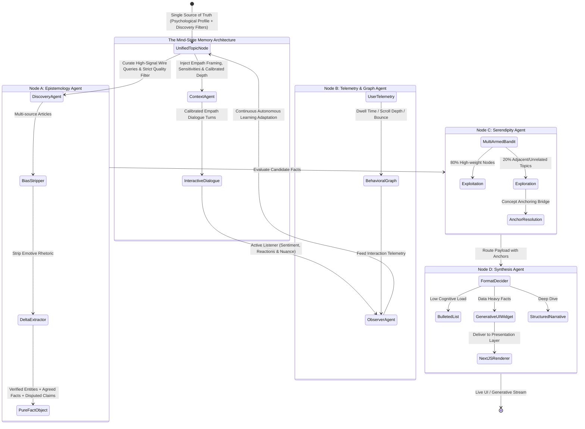

# Project Aletheia: Living System Architecture & Mind-State Memory

> **Auto-Generated by DocWorker Agent**
> **Last Synchronized:** 2026-09-01T22:50:30.062Z

---

## 1. System Philosophy & Objectives
**Project Aletheia: The Mind-State Memory Architecture** transforms stateless conversational tools into a continuous, stateful, and empathy-driven intelligence platform:
1. **Deep Continuity**: Maintains long-term psychological understanding across interactions, understanding *why* users care and their technical depth.
2. **Psychological Awareness**: Injects emotional trajectory, sensitivities, and boundaries into prompts to ensure respectful, nuanced interaction.
3. **Intentional Discovery**: Translates deep preferences into rigorous quality and anti-preference filters, rejecting low-signal fluff before ingestion.
4. **Observability-Driven Adaptation**: Continuously adapts in the background via the Observer Agent with transparent trace logging.

---

## 2. Dynamic State Graph Topology

---

## 3. Node Specifications & Contracts

### The Unified Topic Node (Single Source of Truth)
- **Role:** Centralized repository for conversational metadata and discovery parameters.
- **Components:** Topics, Motivations (`why_they_care`), `technical_depth`, `psychological_profile`, `discovery_parameters`, and `historical_anchors`.

### Context Agent (`node_context`) - The Empath
- **Input:** `UnifiedTopicNode` + User Query + Active Story.
- **Engine:** Evaluates emotional trajectory, active sensitivities, hard boundaries, and intellectual calibration.
- **Output:** Structured context envelope guiding the conversational LLM.

### Discovery Agent (`node_discovery`) - The Curator
- **Input:** `UnifiedTopicNode.discovery_parameters` + Active Topic Vectors.
- **Engine:** Synthesizes high-signal queries, evaluates candidate wire articles, and rejects sensationalist clickbait/anti-preferences.
- **Output:** Curated `RawArticle[]` meeting empirical density thresholds.

### Observer Agent (`node_observer`) - The Active Listener
- **Input:** Recent conversational turns + Behavioral telemetry stream.
- **Engine:** Background sentiment evaluation, motivation extraction, and boundary detection.
- **Output:** Autonomous delta updates to the `UnifiedTopicNode` and transparent adaptation trace logs.

### Node A: Epistemology Agent (`node_a_epistemology`)
- **Input:** Curated `RawArticle[]` from Discovery Agent.
- **Engine:** Bias stripper removing adjectives and emotional rhetoric.
- **Output:** `PureFactObject` with `verified_entities`, `agreed_facts`, and `disputed_claims`.

### Node C: Serendipity Agent (`node_c_serendipity`)
- **Algorithm:** Epsilon-greedy Multi-Armed Bandit ($\\epsilon = 0.20$).
- **Output:** High-affinity topic routing and pedagogical concept anchors.

### Node D: Synthesis Agent (`node_d_synthesis`)
- **Input:** `PureFactObject` + `RoutingDecision` + Reader intellectual profile.
- **Output:** Generative UI event briefing cards with passage highlights and source verification.

---

## 4. Active Observability Audit Trail (Latest Node Traces)

- **[22:50:29] `node_context`**: Heuristically selected 1 topics based on context vectors and affinity weights. *(latency: 0ms)*
- **[22:50:30] `node_a_epistemology`**: Free News Ingestion Engine pulled 6 live articles for "Autonomous Systems" across 6 distinct publications. Ready for Epistemology delta analysis. *(latency: 608ms)*
- **[22:50:30] `node_discovery`**: Curated 6 high-signal articles for topics [Autonomous Systems]. Enforced strict quality filter, rejecting 0 low-signal/sensationalist items. *(latency: 608ms)*
- **[22:50:30] `node_observer`**: Observer Agent analyzed interaction and generated 1 topic state diffs and 1 mind-state adaptations. *(latency: 2ms)*
- **[22:50:30] `node_context`**: Heuristically selected 0 topics based on context vectors and affinity weights. *(latency: 0ms)*
- **[22:50:30] `node_context`**: Heuristically selected 1 topics based on context vectors and affinity weights. *(latency: 1ms)*

---

## 5. Reverse Proxy & Container Infrastructure
- **Caddy Reverse Proxy:** Local/Remote routing on port 80/443 with automated SSL and security headers.
- **Next.js Fullstack Server:** Generative UI frontend and LangGraph agent execution API on port 3000.
