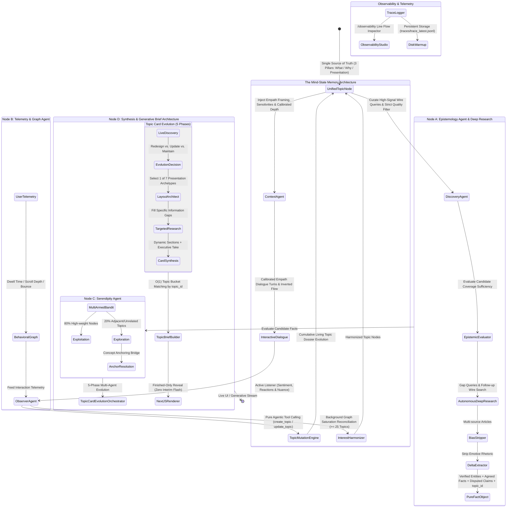

# Project Aletheia: Living System Architecture & Mind-State Memory

> **Auto-Generated by DocWorker Agent**
> **Last Synchronized:** 2026-09-05T14:53:14.912Z

---

## 1. System Philosophy & Mind-State Continuity
**Project Aletheia: The Mind-State Memory Architecture** transforms stateless news tools into a continuous, stateful, and empathy-driven intelligence platform:
1. **Deep Continuity**: Maintains long-term psychological understanding across interactions, tracking *why* users care and their technical depth across domains.
2. **Psychological Awareness**: Injects emotional trajectory, sensitivities, and boundaries into prompts to ensure respectful, nuanced interaction without formulaic conversational repetition.
3. **Intentional Discovery**: Translates deep user preferences into multi-tiered search queries and rigorous quality/anti-preference filters, rejecting low-signal clickbait before ingestion.
4. **Epistemic Deliberation**: Enforces a strict prefix-rationale architecture where agent cognition and fact-checking precede generation, grounded in real-time temporal and spatial realities.
5. **Observability-Driven Adaptation**: Continuously evolves living topic dossiers in the background via the Observer Agent with transparent trace logging in the Execution Studio.
6. **Persistent GUID Topic Intelligence**: Binds every wire story, fact cluster, and brief section to an immutable `topic_id` entity, preventing card duplication, DOM thrashing, and layout collisions.
7. **Finished-Only Card Reveal**: Never renders half-baked or interim wire cards while multi-agent synthesis is active; reveals completed dossiers with zero layout jumps or flashing.

---

## 2. Dynamic State Graph Topology



---

## 3. Living Topic Dossiers: The 3 Core Pillars & Cumulative Evolution

Aletheia models user knowledge not as isolated keywords or flat scores, but as rich, cumulative **Living Topic Dossiers** within the `UnifiedTopicNode`:

### The 3 Core Pillars
1. **What They Care About (`what_they_care_about`)**:
   - The cumulative scope of specific sub-domains, technologies, architectures, and empirical focus areas the user follows.
   - Distinct from general curiosity; captures exact operational boundaries.
2. **Why They Care (`why_they_care`)**:
   - The user's underlying intellectual stakes, motivations, philosophical worldview, and core concerns.
   - Deepens continuously across conversation turns without dropping prior context.
3. **How Best to Present Stories (`presentation_strategy`)**:
   - Editorial direction derived strictly from how the user responds to content, engages with topics, and expresses likes or critiques.
   - Avoids generic templates in favor of tailored density and analytical framing.

### Cumulative Synthesis & Non-Overwrite Guarantee
- **Living Narrative (`living_narrative`)**: A multi-dimensional narrative synthesizing historical context with the newest discussion.
- **Evolution Insight (`evolution_insight`)**: A discrete, single-sentence note capturing the exact incremental shift or nuance introduced in each interaction.
- **Evolution Timeline (`evolution_timeline`)**: An append-only audit trail preserving timestamped insights, trigger sources, and verbatim user evidence.
- **Preferences & Anti-Preferences**: Granular tracking of `likes_and_angles` vs `dislikes_and_critiques`.

---

## 4. Epistemic Deliberation & Inverted Execution Ordering

The conversational intake pipeline in `DialogueAgent` operates under an **inverted execution order** designed to prevent hallucination and enforce factual grounding:

```text
1. Semantic Topic Resolver & Feed Filter FIRST
   └── Traverses user knowledge graph, identifies active discussion subject,
       resolves persistent topic_id, and immediately filters candidate feed stories.

2. Context Agent (The Empath) Grounding SECOND
   └── Constructs context envelope with calibrated technical depth,
       active sensitivities/boundaries, and scores candidate feed stories.

3. Epistemic Sufficiency & Temporal Evaluation THIRD
   └── Evaluates whether local feed context contains verified facts for the current year.
       If insufficient or outdated, autonomously executes live search tools across wires.

4. Prefix-Rationale Dual-Intent Synthesis LAST
   └── Deliberates first: outputs agent_internal_rationale before message text.
       Streams response tokens using JsonMessageStreamExtractor.
```

### Architectural Rules & Guardrails
- **Prefix-Rationale Decision Ordering**: The LLM must construct its internal cognitive rationale (*emotional state, curiosity focus, pedagogical strategy, why this response*) before emitting the conversational message.
- **Real-Time Temporal & Spatial Grounding**: Prompts inject real-world date/time, client timezone, user region, and article publication age to prevent chronological confusion.
- **Absolute Ban on Regex Heuristics**: Epistemic routing and tool selection rely entirely on LLM-driven structured tool-calling protocols.
- **Zero Test-Case Overfitting**: Universal domain-agnostic ontologies and prompts prevent hardcoded test heuristics.

---

## 5. Persistent GUID (`topic_id`) Architecture & Finished-Only Reveal Policy

### Immutable Entity Grounding
- **Intake Boundary Grounding**: Generated deterministically via `generateTopicId(canonicalTopic)` (e.g. `"top_tesla_full_self_driving"`) at the semantic resolver boundary.
- **Full Pipeline Propagation**: Attached to `RawArticle`, `PureFactObject`, `SynthesizedEventCard`, `DynamicBriefSection`, `LLMTopicBriefDesign`, and `TopicBrief`.
- **$O(1)$ Deterministic Bucketing**: `TopicBriefBuilder` maps user topics and incoming cards by GUID in $O(1)$ time, eliminating fuzzy string collisions and duplicate cards.
- **DOM Key Stability**: Emits deterministic `brief.id = topicId`, eliminating `Date.now()` key thrashing and React state wipes.

### Finished-Only Card Reveal Policy
- When targeted curation or brief synthesis is initiated, the system displays a continuous high-fidelity synthesis loading card.
- Interim, raw, or incomplete wire cards are suppressed in `filteredTopicBriefs` until the 5-phase evolution orchestrator finishes.
- The card is revealed on screen for the first and only time **100% finished** with its presentation archetype, custom sections, and executive take.

---

## 6. Topic Card Evolution Orchestrator (5 Phases & 7 Presentation Archetypes)

`TopicCardEvolutionOrchestrator` dynamically re-architects the layout and dynamic sections of topic dossiers based on live incoming intelligence:

### The 5 Evolutionary Phases
1. **Phase 1: Live Data Discovery**: Ingests fresh wire stories and social commentary from Google News, Reddit, and Bluesky.
2. **Phase 2: Evolutionary Decision**: LLM evaluates existing design against fresh delta to decide: `redesign`, `update`, or `maintain`.
3. **Phase 3: Layout Architect Agent**: Selects the optimal presentation archetype and plans dynamic section structures, identifying specific research gaps.
4. **Phase 4: Targeted Research Agent**: Autonomously executes focused search queries to fill identified knowledge gaps.
5. **Phase 5: Card Synthesis Agent**: Synthesizes structured dynamic section payloads, assigns verified source URLs, and generates an overarching executive take.

### The 7 Dynamic Presentation Archetypes
- `field_synthesis`: Comprehensive overview for developing domains with broad coverage.
- `deep_dive_narrative`: In-depth analytical journalism for complex multi-faceted stories.
- `comparative_dossier`: Direct side-by-side comparison across competing architectures, products, or factions.
- `breaking_pulse`: Real-time fast-cadence updates for rapidly unfolding breaking events.
- `regulatory_controversy`: Critical tension analysis balancing institutional scrutiny against industry claims.
- `technical_architecture`: High-density engineering teardowns with specifications, benchmarks, and diagrams.
- `timeline_evolution`: Chronologically anchored historical development arcs.

---

## 7. Epistemic Evaluator & Autonomous Deep Research Loop

- **`EpistemicEvaluator`**: Evaluates candidate news collections for epistemic coverage sufficiency, fact verification across independent sources, and ideological divergences.
- **Autonomous Deep Research Loop**: When coverage is flagged as insufficient, automatically generates follow-up queries, queries live news engines, and enriches candidate collections before epistemology stripping.

---

## 8. Discrete Topic Mutation & Graph Harmonization

### Topic Mutation Engine (`TopicMutationEngine`)
The Observer Agent mutates topics exclusively through atomic, discrete tool calls:
- `create_topic`: Establishes a new topic dossier with validated user evidence.
- `update_topic`: Integrates new nuances, updates weights, and appends to the evolution timeline without overwriting prior history.

### Interest Harmonizer (`InterestHarmonizer`)
When the topic graph approaches saturation ($ge 25$ topics) or when triggered via `/api/interests/harmonize`:
- Evaluates semantic overlap across topic dossiers.
- Merges redundant sub-themes, promotes cross-domain intersections, and purges stale nodes.
- Records all actions in the audited `harmonization_runs` journal on the `UnifiedTopicNode`.

---

## 9. Feed Personalization, Deduplication & Narrative Citations

- **Semantic Matcher**: Computes concept sphere intersections, accounting for knowledge graph weights, curiosity vectors, and domain ontologies.
- **Topic Briefs Builder**: Aggregates stories into intelligence dossiers with velocity indicators (*breaking, active, recent, steady, dormant*).
- **Syndication Deduplication**: Groups identical syndicated wire coverage across news agencies to maintain feed diversity.
- **Sentence-Level Narrative Citations**: Generates synthesized narrative summaries where each sentence features interactive, clickable source citations linked to the `SourceReaderModal`.
- **Decoupled Telemetry**: Passive dwell and scroll tracking is decoupled from feed rendering to eliminate reshuffling and UI jitter.

---

## 10. PostgreSQL Persistence, Tiered User Management & Seed Architecture

- **PostgreSQL 16 + pgvector**: Secure persistence with tables for `unified_topic_nodes`, `user_knowledge_graphs`, `pure_fact_objects`, `behavioral_telemetry`, `agent_trace_logs`, `chat_sessions`, and user accounts.
- **User Management & Monetization**: `UserManager` handles tiered accounts (`free`, `pro`, `enterprise`), usage meters, rate limits, and Stripe subscription sync (`/api/stripe/*`).
- **JSONB DDL Support**: Schema includes `recent_topic_diffs` and `harmonization_runs` on `unified_topic_nodes`.
- **Canonical Seed State (`SEED_DATA_STATE`)**: Embedded baseline data ensures consistent, resilient bootstrapping across local Docker and production AWS environments.
- **Idempotent Migrations (`npm run db:migrate`)**: Safely applies schema updates with `ALTER TABLE ... ADD COLUMN IF NOT EXISTS`.

---

## 11. Agentic Observability & Execution Studio (`/observability`)

- **Dedicated Observability Studio**: Standalone dashboard at `/observability` providing real-time multi-agent execution tracing, token metering, latency profiling, and full prompt inspection.
- **Trace Logger with Disk Warm-Up**: `TraceLogger` persists traces to `traces/trace_latest.jsonl` and automatically warms memory on server boot, preventing trace loss on module hot-reloads.
- **Hierarchical Flow Tracing**: Correlates multi-agent flows across dialogue turns, pipeline ingestion, and card evolution with parent-child trace relationships.
- **Deep Prompt Inspection**: Exposes exact system prompts, injected user prompts, reasoning rationales, and raw LLM completions.

---

## 12. Reverse Proxy & Production Infrastructure

- **AWS ECS Fargate**: Containerized Next.js standalone server deployed in `us-east-1`.
- **AWS RDS PostgreSQL**: Dedicated `db.t4g.micro` PostgreSQL instance with SSL enforcement.
- **Route 53 & CloudFront**: Edge CDN routing `news.ciclops.io` with shared wildcard cookie authentication (`ciclops.io`).
- **Production Inspector (`npm run prod:inspect`)**: Interactive CLI tool for inspecting live production telemetry, user topics, and database connectivity.
- **Local Development**: Supports local development with Docker Compose (`docker-compose.dev.yml`) and automated Caddy reverse proxy.

---

## 13. Micro-Agent Node Contracts & Execution Registry

- **Context Agent (`node_context`)**: Injects empath framing, active sensitivities, boundaries, and calibrated technical depth into conversational prompts.
- **Discovery Agent (`node_discovery`)**: Curates wire queries, applies anti-preference filters, and rejects sensationalist clickbait.
- **Observer Agent (`node_observer`)**: Actively evaluates user dialogue and telemetry to emit atomic topic mutation tool calls.
- **Epistemology Agent (`node_a_epistemology`)**: Strips emotive rhetoric and produces verifiable `PureFactObject` records with agreed facts and disputed claims.
- **Telemetry Agent (`node_b_telemetry`)**: Tracks passive user dwell and scroll depth to adjust interest weights.
- **Serendipity Agent (`node_c_serendipity`)**: Balances exploitation (80%) and exploration (20%) via an $\epsilon$-greedy multi-armed bandit.
- **Synthesis Agent (`node_d_synthesis`)**: Formats pure facts into digestible event cards, briefings, and generative UI widgets.
- **Epistemic Evaluator (`epistemic_evaluator`)**: Analyzes candidate article collections and drives autonomous recursive research loops.
- **Card Evolution Orchestrator (`agent_card_evolution`)**: Directs the 5-phase multi-agent briefing evolution lifecycle.
- **Layout Architect Agent (`node_layout_architect`)**: Selects presentation archetypes and dynamically structures card briefing layouts.

---

## 14. Active Observability Audit Trail (Latest Node Traces)

- **[14:52:24] `node_observer`**: Harmonization tool run [manual_user]: Merged 2 overlapping AI policy topics into canonical node. *(latency: 0ms)*
- **[14:52:24] `node_discovery`**: Epistemic Evaluator reviewed 1 topics. Executed deep research for topics requiring multi-source corroboration, adding 0 newly discovered articles. *(latency: 1ms)*
- **[14:52:24] `node_discovery`**: Curated 1 high-signal articles for topics [FSD 14 3 7 reception]. Epistemic evaluation completed across 1 topics. Enforced strict quality & relevance filter, rejecting 1 low-signal items. *(latency: 1ms)*
- **[14:52:24] `node_context`**: Heuristically selected 0 topics based on context vectors and affinity weights. *(latency: 0ms)*
- **[14:52:24] `node_context`**: Heuristically selected 0 topics based on context vectors and affinity weights. *(latency: 0ms)*
- **[14:52:24] `node_context`**: Context resolved for "General Inquiry" (calibrated depth: practitioner) *(latency: 5ms)*
- **[14:52:24] `agent_dialogue`**: DeepSeek not configured: Served local mock intelligence stream *(latency: 10ms)*
- **[14:52:24] `agent_dialogue`**: Local environment fallback *(latency: 15ms)*
- **[14:52:24] `node_discovery`**: Epistemic Evaluator reviewed 1 topics. Executed deep research for topics requiring multi-source corroboration, adding 5 newly discovered articles. *(latency: 1228ms)*
- **[14:52:26] `node_a_epistemology`**: Ingestion Engine pulled 5 live articles for "Autonomous Systems" via Direct Canonical Sources (Reddit r/SelfDrivingCars, Reddit r/robotics, U.S. Government Publishing Office, SAE International). Ready for Epistemology delta analysis. *(latency: 2648ms)*
- **[14:52:26] `node_discovery`**: Epistemic Evaluator reviewed 1 topics. Executed deep research for topics requiring multi-source corroboration, adding 10 newly discovered articles. *(latency: 361ms)*
- **[14:52:26] `node_discovery`**: Curated 10 high-signal articles for topics [Autonomous Systems]. Epistemic evaluation completed across 1 topics. Enforced strict quality & relevance filter, rejecting 5 low-signal items. *(latency: 3013ms)*
- **[14:52:26] `node_observer`**: Observer Agent analyzed interaction and generated 1 topic state diffs and 1 mind-state adaptations. *(latency: 3ms)*
- **[14:52:26] `node_context`**: Heuristically selected 0 topics based on context vectors and affinity weights. *(latency: 0ms)*
- **[14:52:26] `node_context`**: Context resolved for "General Inquiry" (calibrated depth: practitioner) *(latency: 5ms)*
- **[14:52:27] `agent_dialogue`**: Focus on primary mechanical and electrochemical failure modes. *(latency: 13ms)*
- **[14:52:27] `node_context`**: Heuristically selected 1 topics based on context vectors and affinity weights. *(latency: 0ms)*
- **[14:52:27] `node_context`**: Heuristically selected 0 topics based on context vectors and affinity weights. *(latency: 0ms)*
- **[14:52:27] `node_context`**: Context resolved for "General Inquiry" (calibrated depth: practitioner) *(latency: 5ms)*
- **[14:52:27] `agent_dialogue`**: Clear answer *(latency: 2ms)*
